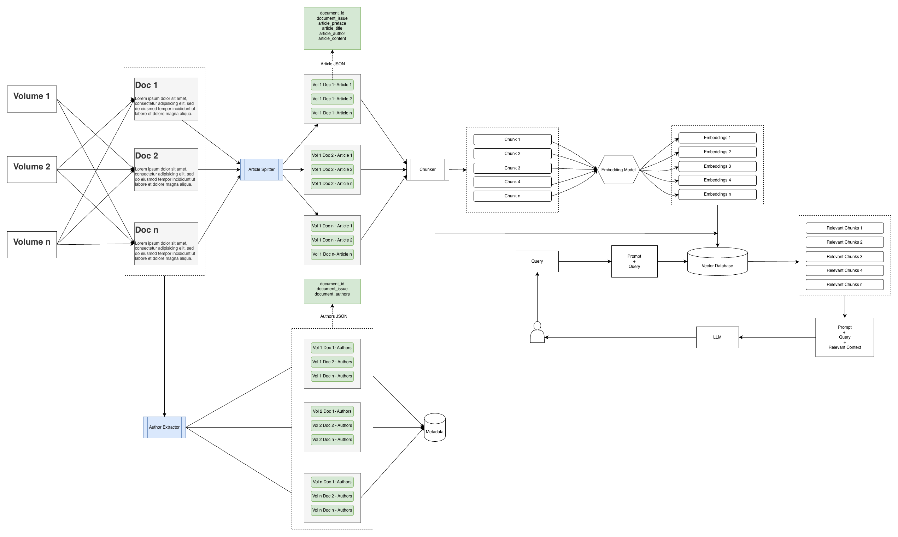

# Ponni RAG

**Ponni RAG** is an intelligent Retrieval-Augmented Generation system designed for Tamil literary documents. It uses a hybrid search approach that combines semantic vector search and keyword-based retrieval to deliver accurate, context-aware results from large collections of Tamil PDF and DOCX files. The system extracts and indexes individual literary articles while preserving author and structural metadata. Every query is routed through Google's Gemini 2.5 Flash API with context-specific prompts to generate natural Tamil responses grounded strictly in the Ponni dataset.

**Two query flows:**
- **Vector search queries** — hybrid retrieval (dense + sparse + RRF fusion) pulls all relevant documents, builds equal-excerpt context from each, and passes it to Gemini with the full document prompt. Evidence cards show full merged content from all relevant sources (dynamically determined by score-gap analysis, up to 10).
- **CSV queries** (authors, topics, issues) — structured data is retrieved from the article database, passed to Gemini with a lightweight gist prompt that summarizes counts, key names, and trends. The answer displays the LLM summary followed by the raw database data appended below a separator — no separate evidence card.

Additionally, the system provides an option to view the original PDF content of each Ponni article volume directly.

## Architecture Diagram:


For detailed architecture documentation, see [system_architecture.md](system_architecture.md).
## Table of Contents
- [Features](#features)
- [Project Structure](#project-structure)
  - [Project Index](#project-index)
- [Getting Started](#getting-started)
  - [Prerequisites](#prerequisites)
  - [Installation](#installation)
  - [Usage](#usage)
- [Docker Deployment](#docker-deployment)
  - [Services Architecture](#services-architecture)
  - [Quick Start with Docker Compose](#quick-start-with-docker-compose)
  - [Docker Commands](#docker-commands)
  - [Service Endpoints](#service-endpoints)
- [React Frontend](#react-frontend)
  - [Frontend Setup](#frontend-setup)
  - [Frontend Features](#frontend-features)
---

## Features

|      | Feature         | Summary       |
| :--- | :---:           | :---          |
| ⚙️  | **Architecture**  | <ul><li>Hybrid search (dense + sparse + RRF fusion) with dynamic evidence selection via score-gap analysis (`hybrid_search.py` orchestrator)</li><li>Dual-prompt LLM pipeline (`llm.py`): gist prompt for CSV queries (summary + appended raw data, no evidence card), full document prompt for vector search (equal-excerpt context from all relevant sources)</li><li>Utilizes Qdrant vector database for efficient similarity search and document retrieval (`qdrant_indexer.py`)</li><li>AWS S3 integration for scalable document storage and retrieval (`s3_utils.py`)</li></ul> |
| 🔩 | **Code Quality**  | <ul><li>Modular design with separate modules for extraction (`text_extraction.py`), article separation (`article_seperation.py`), and search split across focused sub-modules (`hybrid_search.py`, `tamil_text.py`, `csv_queries.py`, `llm.py`, `search.py`)</li><li>Centralized configuration settings in `config/config.py` for consistency and easy modification</li><li>Comprehensive test coverage with unit and integration tests</li></ul> |
| 🔌 | **Integrations**  | <ul><li>Integrates with `AWS S3` for efficient storage and retrieval of documents and processed data</li><li>Utilizes `Qdrant` vector database for semantic search and similarity matching</li><li>Streamlit-based interactive UI for querying and visualization (`streamlit_app.py`)</li></ul> |
| 🧩 | **Modularity**    | <ul><li>Search backend split into focused modules: orchestration (`hybrid_search.py`), Tamil NLP (`tamil_text.py`), CSV queries (`csv_queries.py`), LLM layer (`llm.py`), document processing (`search.py`)</li><li>Separate modules for text extraction (`text_extraction.py`), content processing (`content_extraction.py`), and text processing (`text_processing.py`)</li><li>Article separation and pattern matching encapsulated in `article_seperation.py` and `article_patterns.py`</li><li>Configuration settings isolated in `config/config.py`</li><li>Comprehensive test suites for quality assessment in `tests/`</li></ul> |

---

## Project Structure

```
├── frontend/                    # React.js Frontend
│   ├── src/
│   │   ├── components/          # Navigation, ChatMessage, ChatInput
│   │   ├── pages/               # Home, Library, Issues, PDFViewer, TagBrowse, About
│   │   ├── services/            # API client, translations
│   │   └── styles/              # CSS styles
│   ├── Dockerfile
│   ├── nginx.conf
│   └── package.json
├── src/
│   ├── config/
│   │   └── config.py
│   ├── data_extraction/
│   │   ├── article_patterns.py
│   │   ├── article_seperation.py
│   │   ├── content_extraction.py
│   │   ├── csv_fuzzy_matcher.py
│   │   ├── doc_utils.py
│   │   ├── s3_utils.py
│   │   ├── shared_author.py
│   │   ├── shared_author_local.py
│   │   ├── text_extraction.py
│   │   └── text_processing.py
│   ├── db/
│   │   ├── api.py               # FastAPI REST API
│   │   ├── article_tagger.py    # Hybrid article tagger (rule-based + TF-IDF)
│   │   ├── cache.py             # LRU response cache with TTL
│   │   ├── embeddings.py        # Embedding generation, Qdrant client, sparse/dense
│   │   ├── hybrid_search.py     # Orchestrator (search, caching, model loaders)
│   │   ├── tamil_text.py        # Tamil NLP utilities, fuzzy matching, pattern bank
│   │   ├── csv_queries.py       # CSV query pipeline (authors, topics, issues)
│   │   ├── llm.py               # Gemini LLM layer (prompts, generation)
│   │   ├── search.py            # Vector search document processing
│   │   ├── pdf_links.py
│   │   ├── qdrant_indexer.py
│   │   ├── streamlit_app.py
│   │   ├── update_csv_tags.py   # Maintenance: update CSV with Qdrant tags
│   │   └── summary.csv
│   ├── tests/
│   └── evaluation/
│       ├── evaluate.py          # Evaluation pipeline & CLI
│       ├── metrics.py           # Semantic, BLEU, ROUGE, BERTScore
│       ├── dataset.py           # Dataset loading (JSON/CSV)
│       └── ground_truth_template.csv #Template for the ground truth data 
│       └── ground_truth_data.csv #actual ground truth data to evaluate 
│       └── ground_truth_report.xlsx #The evaluated results 
├── docker-compose.yml           # Multi-service orchestration
├── Dockerfile                   # Streamlit container
├── Dockerfile.api               # FastAPI container
└── requirements.txt
```
###  Project Index
<details open>
    <summary><b><code>/</code></b></summary>
    <details> 
        <summary><b>config</b></summary>
        <blockquote>
            <table>
            <tr>
                <td><b><a href='config/config.py'>config.py</a></b></td>
                <td>- Defines configuration settings and parameters for the Ponni RAG system<br>- Specifies S3 storage locations, Qdrant connection details, embedding model configurations, and API credentials<br>- Centralizes key variables to ensure consistency across the codebase and enables easy modification of project-wide settings.</td>
            </tr>
            </table>
        </blockquote>
    </details>
    <details> 
        <summary><b>data_extraction</b></summary>
        <blockquote>
            <table>
            <tr>
                <td><b><a href='data_extraction/article_patterns.py'>article_patterns.py</a></b></td>
                <td>- Pattern recognition module that defines regex patterns and heuristics for identifying article boundaries, titles, authors, and structural elements<br>- Enables accurate detection of article starts, section markers, and metadata within Tamil literary documents<br>- Provides configurable patterns for robust document segmentation.</td>
            </tr>
            <tr>
                <td><b><a href='data_extraction/article_seperation.py'>article_seperation.py</a></b></td>
                <td>- Article separation engine that splits multi-article documents into individual articles using pattern matching and structural analysis<br>- Processes documents to identify article boundaries, preserves metadata, and maintains document integrity<br>- Enables fine-grained indexing and retrieval by creating standalone article records for the vector database.</td>
            </tr>
            <tr>
                <td><b><a href='data_extraction/content_extraction.py'>content_extraction.py</a></b></td>
                <td>- Content processing pipeline that extracts structured information from raw documents<br>- Handles text cleaning, format normalization, boilerplate removal, and content parsing<br>- Preserves meaningful document structure while preparing content for vectorization and semantic search.</td>
            </tr>
            <tr>
                <td><b><a href='data_extraction/csv_fuzzy_matcher.py'>csv_fuzzy_matcher.py</a></b></td>
                <td>- CSV-based article extraction with fuzzy title matching and boundary detection<br>- Handles multi-author parsing and malformed CSV values<br>- Supports filename/text-based மலர்–இதழ் extraction with fallback<br>- Ensures accurate content slicing by preferring standalone titles over TOC</td>
            </tr>
            <tr>
                <td><b><a href='data_extraction/doc_utils.py'>doc_utils.py</a></b></td>
                <td>- Document handling utilities for processing PDF and DOCX files<br>- Provides functions for document loading, format conversion, validation, and batch processing<br>- Implements robust error handling and format-specific processing logic<br>- Supports streaming operations for large documents.</td>
            </tr>
            <tr>
                <td><b><a href='data_extraction/s3_utils.py'>s3_utils.py</a></b></td>
                <td>- AWS S3 integration layer for document storage, retrieval, and lifecycle management<br>- Handles file uploads, downloads, metadata operations, and versioning<br>- Implements connection pooling, retry logic, and structured logging for reliability<br>- Provides production-ready S3 operations with comprehensive error handling.</td>
            </tr>
            <tr>
                <td><b><a href='data_extraction/shared_author.py'>shared_author.py</a></b></td>
                <td>- Author extraction and metadata enrichment module for literary documents<br>- Identifies and extracts author information from documents with multi-author support<br>- Handles author name normalization and associates authors with respective articles<br>- Enables author-based search, filtering, and metadata organization.</td>
            </tr>
            <tr>
                <td><b><a href='data_extraction/text_extraction.py'>text_extraction.py</a></b></td>
                <td>- Primary text extraction pipeline that converts documents to machine-readable text<br>- Implements OCR fallback for scanned documents and images<br>- Handles text encoding, language detection (Tamil/English), and character normalization<br>- Preserves document structure while extracting clean, searchable text.</td>
            </tr>
            <tr>
                <td><b><a href='data_extraction/text_processing.py'>text_processing.py</a></b></td>
                <td>- Text preprocessing and normalization utilities for Tamil literary content<br>- Implements cleaning, tokenization, and text standardization functions<br>- Handles special characters, whitespace, and formatting inconsistencies<br>- Prepares text for embedding generation and semantic analysis with configurable preprocessing pipelines.</td>
            </tr>
            </table>
        </blockquote>
    </details>
    <details>
        <summary><b>data</b></summary>
        <blockquote>
            <table>
            <tr>
                <td><b><a href='db/summary.csv'>summary.csv</a></b></td>
                <td>- Document catalog storing metadata, processing statistics, and indexing status<br>- Contains indexed document information, extraction metrics, and quality scores<br>- Enables quick lookups, reporting, and audit trails for the document collection<br>- Supports data governance and collection management.</td>
            </tr>
            </table>
        </blockquote>
    </details>
    <details> 
        <summary><b>db</b></summary>
        <blockquote>
            <table>
            <tr>
                <td><b><a href='db/api.py'>api.py</a></b></td>
                <td>- FastAPI backend for Ponni RAG system: search, Q&A, authors, tags, library APIs<br>- Hybrid retrieval + LLM integration (Qdrant + Gemini) with streaming support (SSE)<br>- S3 image proxy for volume/issue covers with caching and fallback handling<br>- CSV-based author/topic queries with caching and thread-safe initialization<br>- Tag taxonomy aggregation and filtering using vector metadata<br>- Library endpoints for volumes, issues, PDFs, and full article retrieval (chunk merge)<br>- Health monitoring for database (Qdrant), LLM (Gemini), and API<br>- Response caching, error handling, and scalable async architecture</td>
            </tr>
            <tr>
                <td><b><a href='db/article_tagger.py'>article_tagger.py</a></b></td>
                <td>- Hybrid article classification using rule-based patterns + TF-IDF fallback<br>- Assigns 1–3 tags from a predefined 15-category taxonomy (Tamil + English)<br>- Handles multi-author inputs and serial detection for fiction articles<br>- Fully offline tagging (no LLM) with deterministic and fast processing</td>
            </tr>
             <tr>
                <td><b><a href='db/cache.py'>cache.py</a></b></td>
                <td>- hread-safe in-memory cache with TTL (expiry) and LRU eviction policy<br>- Caches ask_question results using normalized + hashed query keys<br>- Auto-invalidates cache when Qdrant index (points_count) changes<br>- Provides cache stats (hit rate, size) and supports manual clearing</td>
            </tr>
            <tr>
                <td><b><a href='db/csv_queries.py'>csv_queries.py</a></b></td>
                <td>- CSV query pipeline: author listing, author→topics, topic→authors, issue counts<br>- EnhancedAuthorQuerySystem with fuzzy author/title matching<br>- Formatting functions and CSV answer composition with LLM gist summaries</td>
            </tr>
             <tr>
                <td><b><a href='db/embeddings.py'>embeddings.py</a></b></td>
                <td>- Embedding + hybrid search engine using dense (E5) and sparse (BM25-style) vectors<br>- Thread-safe singleton loading for model, Qdrant client, and CSV embeddings<br>- Semantic CSV search with precomputed embeddings and author normalization<br>- Hybrid Qdrant retrieval with tag filtering, RRF fusion, and health monitoring</td>
            </tr>
             <tr>
                <td><b><a href='db/guardrails.py'>guardrails.py</a></b></td>
                <td>-  Prompt security layer with injection detection, query sanitization, and history validation<br>- Blocks malicious instructions (role override, system prompt extraction, etc.)<br>- Output filtering to prevent leakage of secrets, configs, or internal details<br>- Provides safe error handling and hardened prompts for secure LLM interaction</td>
            </tr>
            <tr>
                <td><b><a href='db/hybrid_search.py'>hybrid_search.py</a></b></td>
                <td>- Orchestrator module: coordinates query routing, embedding generation, caching, and model loading<br>- Combines dense (E5 embeddings) + sparse (BM25-style) retrieval with Qdrant RRF fusion<br>- GPU/CPU auto-detection with device-specific optimizations (TF32 on CUDA, thread tuning on CPU)<br>- Re-exports all sub-module names for backward compatibility</td>
            </tr>
            <tr>
                <td><b><a href='db/llm.py'>llm.py</a></b></td>
                <td>- Gemini LLM layer: sync, async, and streaming answer generation<br>- Dual-prompt system: TAMIL_ANSWER_SYSTEM_PROMPT for vector search, _CSV_SYSTEM_PROMPT for structured data<br>- Question-type detection (wh-questions, yes/no) for prompt optimization<br>- Extractive answer fallback when LLM is unavailable</td>
            </tr>
             <tr>
                <td><b><a href='db/qdrant_indexer.py'>qdrant_indexer.py</a></b></td>
                <td>- Qdrant vector database integration for embedding storage and similarity search<br>- Handles collection creation, vector indexing, and batch insertion operations<br>- Implements efficient large-scale indexing with configurable distance metrics<br>- Provides similarity search with metadata filtering and payload storage<br>- Includes connection management, retry logic, and error recovery.</td>
            </tr>
            <tr>
                <td><b><a href='db/retry.py'>retry.py</a></b></td>
                <td>- Retry utilities with exponential backoff and jitter for resilient API calls<br>- Detects transient errors for Qdrant and Gemini (timeouts, rate limits, server errors)<br>- Supports both sync and async retry mechanisms<br>- Provides service-specific wrappers for reliable external service handling</td>
            </tr>
            <tr>
                <td><b><a href='db/search.py'>search.py</a></b></td>
                <td>- Vector search document processing: chunk retrieval, consecutive chunk merging, key fact extraction<br>- Dynamic evidence selection via score-gap analysis (floor 30% of top, consecutive gap 40%, max 10)<br>- Equal-excerpt context building (15K char budget distributed across relevant docs)<br>- Source formatting for evidence cards</td>
            </tr>
            <tr>
                <td><b><a href='db/snapshot_manager.py'>snapshot_manager.py</a></b></td>
                <td>- Manages Qdrant index snapshots with S3 for persistence and recovery<br>- Detects reindex needs using embedding fingerprint + source data hash<br>- Handles snapshot upload/download between Qdrant and S3<br>- Stores index metadata (versioning, timestamps, config) for consistency tracking</td>
            </tr>
            <tr>
                <td><b><a href='db/streamlit_app.py'>streamlit_app.py</a></b></td>
                <td>- Interactive web interface for querying the Ponni RAG system<br>- Provides user-friendly search and document exploration capabilities<br>- Displays search results with relevance scores, source attribution, and metadata<br>- Tags/Categories page: browse 15 article categories with counts, drill into article lists (mirrors React TagBrowse)<br>- Supports advanced filtering, query refinement, and result visualization<br>- Includes performance metrics and search quality indicators.</td>
            </tr>
            <tr>
                <td><b><a href='db/tamil_text.py'>tamil_text.py</a></b></td>
                <td>- Tamil NLP utilities: fuzzy matching, edit distance, possessive suffix stripping<br>- Pattern bank with compiled regexes for Tamil word boundaries, initials, and canonical author mappings</td>
            </tr>
            <tr>
                <td><b><a href='db/update_csv_tags.py'>update_csv_tags.py</a></b></td>
                <td>- Updates CSV with article tags by querying Qdrant using doc_id, doc_issue, and article_no<br>- Maps each CSV row to its corresponding indexed article (chunk_id=0)<br>- Handles multi-author CSV parsing and numeric normalization (e.g. "1.0" → "1")<br>- Writes Tamil category labels ('வகை') back into summary.csv</td>
            </tr>
            </table>
        </blockquote>
    </details>
    <details>
        <summary><b>evaluation</b></summary>
        <blockquote>
            <table>
            <tr>
                <td><b><a href='evaluation/dataset.py'>dataset.py</a></b></td>
                <td>- Loads evaluation datasets from JSON or CSV into structured EvalSample objects<br>- Supports flexible formats with optional fields (llm_answer, category, notes)<br>- Validates and filters incomplete samples while logging issues<br>- Provides utility to save updated datasets with evaluation results</td>
            </tr>
            <tr>
                <td><b><a href='evaluation/evaluate.py'>evaluate.py</a></b></td>
                <td>-  End-to-end evaluation pipeline for RAG (offline + live modes)<br>- Computes metrics (semantic similarity, BLEU, ROUGE, BERTScore, composite)<br>- Integrates with RAG system to generate answers during live evaluation<br>- Outputs detailed reports (console + Excel/JSON) with per-sample breakdown</td>
            </tr>
            <tr>
                <td><b><a href='evaluation/metrics.py'>metrics.py</a></b></td>
                <td>- Implements Tamil-aware evaluation metrics (semantic similarity, BLEU, ROUGE-L)<br>- Uses multilingual-e5-large for embedding-based semantic scoring<br>- Applies character-level BLEU and ROUGE for Tamil morphology handling<br>- Computes weighted composite score prioritizing semantic similarity</td>
            </tr>
            <tr>
                <td><b><a href='evaluation/ground_truth_data.csv'>ground_truth_data.csv</a></b></td>
                <td>- Contains 50 Tamil Q&A samples for RAG evaluation<br>- Columns: id, question, human_answer<br>- Covers diverse topics: literature, politics, culture, history<br>- Used for both offline and live evaluation pipelines<br>- Compatible with dataset_loader + evaluation pipeline</td>
            </tr>
            <tr>
                <td><b><a href='evaluation/ground_truth_template.csv'>ground_truth_data.csv</a></b></td>
                <td>- Structured evaluation template for PonniRAG (30 questions)<br>- Columns: id, question, human_answer (to be filled), category, notes<br>- Covers key domains: magazine facts, authors, literature, politics, history<br>- Used for curated, high-quality evaluation (gold answers required)<br>- Designed for manual annotation + expert validation</td>
            </tr>
            <tr>
                <td><b><a href='evaluation/ground_truth_report.xlsx'>ground_truth_data.csv</a></b></td>
                <td>- Generated evaluation report comparing LLM answers vs human ground truth<br>- Includes metrics: semantic similarity, BLEU, ROUGE-L, BERTScore, composite score<br>- Highlights retrieval issues, verbosity, and answer mismatches in RAG system<br>- Shows per-question performance for detailed error analysis<br>- Used to debug and improve retrieval, prompting, and answer quality</td>
            </tr>
            </table>
        </blockquote>
    </details>
    <details> 
        <summary><b>tests</b></summary>
        <blockquote>
            <table>
            <tr>
                <td><b><a href='tests/conftest.py'>conftest.py</a></b></td>
                <td>- Pytest configuration and shared test fixtures<br>- Defines common test setup, teardown procedures, and mock objects<br>- Provides reusable test utilities and helper functions<br>- Configures test environment, logging, and test discovery settings.</td>
            </tr>
            <tr>
                <td><b><a href='tests/test_article_patterns.py'>test_article_patterns.py</a></b></td>
                <td>- Unit tests for pattern recognition and article boundary detection<br>- Validates regex patterns and heuristic rules for identifying article structures<br>- Tests edge cases and pattern matching accuracy.</td>
            </tr>
            <tr>
                <td><b><a href='tests/test_article_seperation.py'>test_article_seperation.py</a></b></td>
                <td>- Unit tests for document segmentation and article separation functionality<br>- Validates article boundary detection and metadata preservation<br>- Tests multi-article document processing.</td>
            </tr>
            <tr>
                <td><b><a href='tests/test_content_extraction.py'>test_content_extraction.py</a></b></td>
                <td>- Unit tests for content extraction and text cleaning processes<br>- Validates boilerplate removal and structure preservation<br>- Tests format normalization and content parsing logic.</td>
            </tr>
            <tr>
                <td><b><a href='tests/test_content_extraction_integration.py'>test_content_extraction_integration.py</a></b></td>
                <td>- Integration tests for end-to-end content extraction pipeline<br>- Validates complete workflow from document input to structured output<br>- Tests integration with storage and downstream components.</td>
            </tr>
            <tr>
                <td><b><a href='tests/test_doc_utils.py'>test_doc_utils.py</a></b></td>
                <td>- Unit tests for document processing utilities and format handling<br>- Validates PDF and DOCX loading, conversion, and validation<br>- Tests error handling for corrupted or invalid files.</td>
            </tr>
            <tr>
                <td><b><a href='tests/test_doc_utils_integration.py'>test_doc_utils_integration.py</a></b></td>
                <td>- Integration tests for document processing workflows<br>- Validates end-to-end document handling from loading to extraction<br>- Tests batch processing and streaming operations.</td>
            </tr>
            <tr>
                <td><b><a href='tests/test_hybrid_search.py'>test_hybrid_search.py</a></b></td>
                <td>- Unit tests for hybrid search scoring, ranking, and result merging<br>- Validates semantic and keyword search integration<br>- Tests result aggregation and filtering logic.</td>
            </tr>
            <tr>
                <td><b><a href='tests/test_qdrant_indexer.py'>test_qdrant_indexer.py</a></b></td>
                <td>- Unit tests for vector database operations and indexing logic<br>- Validates collection creation, vector insertion, and similarity search<br>- Tests batch operations and error recovery.</td>
            </tr>
            <tr>
                <td><b><a href='tests/test_s3_utils.py'>test_s3_utils.py</a></b></td>
                <td>- Unit tests for S3 storage operations and error handling<br>- Validates upload, download, and metadata operations<br>- Tests connection pooling and retry logic.</td>
            </tr>
            <tr>
                <td><b><a href='tests/test_shared_author.py'>test_shared_author.py</a></b></td>
                <td>- Unit tests for author extraction and metadata enrichment<br>- Validates author identification and name normalization<br>- Tests multi-author scenarios and edge cases.</td>
            </tr>
            <tr>
                <td><b><a href='tests/test_shared_author_integration.py'>test_shared_author_integration.py</a></b></td>
                <td>- Integration tests for author extraction pipeline<br>- Validates end-to-end author processing workflow<br>- Tests integration with document metadata and search.</td>
            </tr>
            <tr>
                <td><b><a href='tests/test_streamlit_app.py'>test_streamlit_app.py</a></b></td>
                <td>- Unit tests for Streamlit interface components and interactions<br>- Validates UI rendering, user input handling, and result display<br>- Tests search functionality and visualization components.</td>
            </tr>
            <tr>
                <td><b><a href='tests/test_text_extraction.py'>test_text_extraction.py</a></b></td>
                <td>- Unit tests for text extraction pipeline and OCR fallback<br>- Validates text encoding, language detection, and character normalization<br>- Tests extraction accuracy for various document types.</td>
            </tr>
            <tr>
                <td><b><a href='tests/test_text_processing.py'>test_text_processing.py</a></b></td>
                <td>- Unit tests for text preprocessing and normalization functions<br>- Validates cleaning, tokenization, and standardization logic<br>- Tests handling of special characters and Tamil text.</td>
            </tr>
            <tr>
                <td><b><a href='tests/test_text_processing_integration.py'>test_text_processing_integration.py</a></b></td>
                <td>- Integration tests for complete text processing workflows<br>- Validates end-to-end preprocessing pipeline<br>- Tests integration with embedding generation and search.</td>
            </tr>
            </table>
        </blockquote>
    </details>
</details>

## Document Storage and Processing Pipeline
This module provides utility functions for managing document storage and processing using **AWS S3**.

#### S3 Initialization
- Initializes an authenticated S3 client using `boto3`
- Fails fast if credentials are missing or invalid

#### Document Discovery
- Lists files in an S3 bucket/prefix with optional file-type filtering
- Used to identify raw or processed documents

#### Document Ingestion
- Reads binary files (PDF, DOCX, etc.) from S3 as byte streams
- Feeds documents into downstream processing (OCR/NLP)

#### Processed Output Storage
- Uploads extracted text as UTF-8 encoded `.txt` files
- Uploads structured outputs (metadata, results) as formatted `.json`

#### Data Retrieval
- Reads stored text and JSON files from S3 for further use

#### File Management
- Checks file existence to avoid reprocessing

## Getting Started

### Prerequisites

Before getting started with Ponni RAG, ensure your runtime environment meets the following requirements:

- **Programming Language:** Python 3.9+
- **Required Services:**
  - AWS S3 (for document storage)
  - Qdrant Vector Database (local or cloud instance)
  - Gemini API key ([get one here](https://ai.google.dev/))
  - CUDA-compatible GPU (optional, for faster embedding generation)

### Installation

**Build from source:**

1. Clone the Ponni RAG repository:
```sh
git clone https://github.com/nunnarilabs/PonniRAG.git
```

2. Navigate to the project directory:
```sh
cd PonniRAG
```

3. Create a Virtual Environment:
```sh
python -m venv venv
source venv/bin/activate  # On Windows: venv\Scripts\activate
```

4. Upgrade pip:
```sh
pip install --upgrade pip
```

5. Install the project dependencies:
```sh
pip install -r requirements.txt
```

6. Configure environment variables:
```sh
cp .env.example .env
# Edit .env with your credentials:
#   AWS_ACCESS_KEY_ID=<your-access-key>
#   AWS_SECRET_ACCESS_KEY=<your-secret-key>
#   GEMINI_API_KEY=<your-gemini-api-key>
```

### Usage

**Run document indexing:**
```sh
cd src
python -m db.qdrant_indexer
```

**Run the Streamlit interface:**
```sh
cd src/db
streamlit run streamlit_app.py
```

**Run the FastAPI backend:**
```sh
cd src/db
uvicorn api:app --host 0.0.0.0 --port 8000
```

**Run the React frontend:**
```sh
cd frontend
npm install
npm start
```

---

## Docker Deployment

The application can be deployed using Docker Compose, which orchestrates three services: Qdrant (vector database), FastAPI (REST API + Gemini LLM), and React (frontend). LLM inference uses the Gemini API — no local GPU required.

### Services Architecture

```
┌────────────────────────────────────────────────────────────┐
│                      Docker Compose                        │
├─────────────────┬─────────────────┬────────────────────────┤
│     Qdrant      │     FastAPI     │         React          │
│   :6333/6334    │      :8000      │         :3000          │
│  Vector Store   │  REST API +     │      Frontend UI       │
│                 │  Gemini LLM     │                        │
└─────────────────┴─────────────────┴────────────────────────┘
                          │
                    Gemini 2.5 Flash API
                   (Google Cloud, external)
```

### Quick Start with Docker Compose

1. **Configure environment variables:**
```sh
cp .env.docker.example .env.docker
# Edit .env.docker with your AWS credentials and Gemini API key
```

2. **Build and start all services:**
```sh
docker-compose up --build
```

3. **Run in detached mode (background):**
```sh
docker-compose up -d --build
```

### Docker Commands

| Command | Description |
|---------|-------------|
| `docker-compose up --build` | Build and start all services |
| `docker-compose up -d` | Start services in background |
| `docker-compose logs -f` | View logs from all services |
| `docker-compose logs -f api` | View logs from FastAPI only |
| `docker-compose down` | Stop all services |
| `docker-compose down -v` | Stop and remove volumes |
| `docker-compose ps` | List running services |
| `docker-compose restart api` | Restart a specific service |

### Service Endpoints

Once running, the services are available at:

| Service | URL | Description |
|---------|-----|-------------|
| React Frontend | http://localhost:3000 | Modern React.js interface |
| Streamlit UI | http://localhost:8501 | Legacy Streamlit interface |
| FastAPI Docs | http://localhost:8000/docs | Swagger API documentation |
| FastAPI Health | http://localhost:8000/health | API health check endpoint |
| Qdrant Dashboard | http://localhost:6333/dashboard | Vector database dashboard |

### API Endpoints

The FastAPI service exposes the following endpoints:

| Method | Endpoint | Description |
|--------|----------|-------------|
| `GET` | `/health` | Health check (API + Qdrant) |
| `POST` | `/api/ask` | Ask a question (Gemini LLM) |
| `POST` | `/api/ask/stream` | Streaming answer via SSE |
| `GET` | `/api/search?q=<query>` | Search the archive |
| `GET` | `/api/authors` | List all authors |
| `GET` | `/api/authors/{name}/articles` | Get articles by author |
| `GET` | `/api/topics/search?topic=<topic>` | Search by topic |
| `GET` | `/api/issues/stats` | Issue statistics |
| `GET` | `/api/library/volumes` | List all volumes |
| `GET` | `/api/library/volumes/{id}/issues` | Get issues for a volume |
| `GET` | `/api/library/volumes/{id}/issues/{issue}/pdf` | Get PDF link |
| `GET` | `/api/tags` | List all article categories with counts |
| `GET` | `/api/tags/{tag_id}/articles` | Get articles for a category |
| `GET` | `/api/cache/stats` | Cache hit/miss stats |
| `POST` | `/api/cache/clear` | Clear response cache |

### Building Individual Images

**Build Streamlit image:**
```sh
docker build -t ponni-streamlit -f Dockerfile .
```

**Build FastAPI image:**
```sh
docker build -t ponni-api -f Dockerfile.api .
```

**Build React frontend image:**
```sh
docker build -t ponni-frontend -f frontend/Dockerfile ./frontend
```

### GPU Support

LLM inference uses the Gemini API (cloud) — no local GPU is required. A GPU is only beneficial for faster embedding generation with `intfloat/multilingual-e5-large`. The embedding model automatically detects GPU availability at startup: on CUDA-capable hardware it enables TF32 acceleration; on CPU-only systems it optimizes PyTorch thread allocation for best throughput. For NVIDIA GPU support on the API container, ensure you have the NVIDIA Container Toolkit installed and add to `docker-compose.yml`:

```yaml
services:
  api:
    deploy:
      resources:
        reservations:
          devices:
            - driver: nvidia
              count: 1
              capabilities: [gpu]
```

---

## React Frontend

A modern React.js frontend is available as an alternative to the Streamlit UI. It provides the same features with a more responsive, production-ready interface.

### Frontend Setup

**Local Development:**

```sh
cd frontend
npm install
npm start
```

The React app will be available at http://localhost:3000

**With Docker Compose:**

```sh
docker-compose up frontend
```

### Frontend Features

| Feature | Description |
|---------|-------------|
| AI Search | Chat-based interface for querying the archive |
| Digital Library | Browse volumes and issues with cover images |
| PDF Viewer | Embedded PDF viewer for magazine issues |
| Tags / Categories | Browse 15 article categories with article counts, drill into article lists |
| Language Toggle | Switch between Tamil and English |
| Responsive Design | Works on desktop and mobile devices |

### Frontend Structure

```
frontend/
├── src/
│   ├── components/      # Navigation, ChatMessage, ChatInput, TagFilter
│   ├── pages/           # Home, Library, Issues, PDFViewer, TagBrowse, About
│   ├── services/        # API client, translations
│   └── styles/          # CSS matching Streamlit UI
├── Dockerfile
└── nginx.conf
```

### Service URLs (with Docker)

| Service | URL | Description |
|---------|-----|-------------|
| React Frontend | http://localhost:3000 | Modern React UI |
| FastAPI | http://localhost:8000 | REST API backend (+ Gemini LLM) |
| Qdrant | http://localhost:6333 | Vector database |
| Streamlit | http://localhost:8501 | Legacy Streamlit UI |


